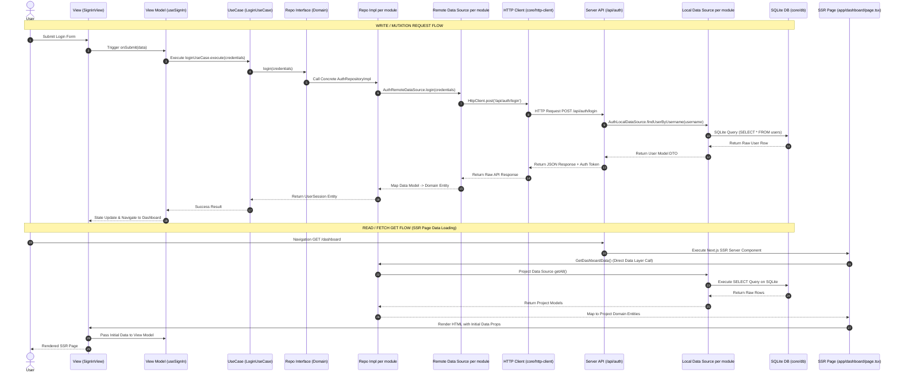

# Clean Architecture + SSR (SQLite, Core & Data Layer Split)

Dokumen arsitektur Clean Architecture + SSR (Next.js App Router) dengan pemisahan layer **Core**, **Domain**, dan **Data**, penyimpanan **SQLite Database**, serta **MVVM Pattern**.

---

## 1. Pembagian Structural Layer

1. **Core Layer (`src/core/`)**:
   - **`http-client/`**: Driver / Client HTTP untuk komunikasi client-server (Fetch / Axios / Custom HTTP wrapper).
   - **`db/`**: Connection driver, instance SQLite Database (Prisma / Drizzle / better-sqlite3), serta config DB.
   - **`errors/` & `utils/`**: Shared core exceptions & utilities.

2. **Domain Layer (`src/domain/`)**:
   - Struktur per module:
     - `src/domain/project/entity/`
     - `src/domain/project/usecase/`
     - `src/domain/project/repository/`
     - `src/domain/environment/entity/`
     - `src/domain/environment/usecase/`
     - `src/domain/environment/repository/`
     - `src/domain/api/entity/`
     - `src/domain/api/usecase/`
     - `src/domain/api/repository/`
     - `src/domain/request-scenario/entity/`
     - `src/domain/request-scenario/usecase/`
     - `src/domain/request-scenario/repository/`
     - `src/domain/response-scenario/entity/`
     - `src/domain/response-scenario/usecase/`
     - `src/domain/response-scenario/repository/`
   - Setiap module menyimpan file usecase seperti `<module>_usecase.ts`.

3. **Data Layer (`src/data/`)**:
   - Struktur per module:
     - `src/data/project/model/`
     - `src/data/project/data_source/`
     - `src/data/project/repository/`
     - `src/data/environment/model/`
     - `src/data/environment/data_source/`
     - `src/data/environment/repository/`
     - `src/data/api/model/`
     - `src/data/api/data_source/`
     - `src/data/api/repository/`
     - `src/data/request/model/`
     - `src/data/request/data_source/`
     - `src/data/request/repository/`
     - `src/data/response/model/`
     - `src/data/response/data_source/`
     - `src/data/response/repository/`
   - Setiap module menyimpan data source seperti `<module>_data_source.ts` dan `<module>_data_source_impl.ts`.

4. **Presentation Layer (`src/presentation/views/`)**:
   - **Feature Co-located MVVM**: `View.tsx`, `hook/use[Feature].ts` (View Model), dan `components/` (Sub-widgets UI).

---

## 2. Dynamic Data Flow

### A. Write / Mutation Flow (Post, Put, Delete, Form Submission)
```text
[ View Component (SignInView.tsx) ]
         │
         ▼
[ View Model Hook (hook/useSignIn.ts) ]
         │
         ▼
[ Use Case (LoginUseCase - Domain) ]
         │
         ▼
[ Repository Interface (Domain) ]
         │  (Implemented by)
         ▼
[ Repository Impl per module (data/repositories/[module]/...) ]
         │
         ▼
[ Remote Resource per module (data/resources/remote/[module]/...) ]
         │
         ▼
[ Core HTTP Client (core/http-client/api-client.ts) ]
         │
         ▼
[ Server API Route (app/api/auth/route.ts) ]
         │
         ▼
[ Local Resource per module (data/resources/local/[module]/...) ]
         │
         ▼
[ Core SQLite DB (core/db/sqlite-client.ts) ]
```

### B. Read / Fetch GET Flow (SSR Page Rendering)
```text
[ Core SQLite DB (core/db/sqlite-client.ts) ]
         │
         ▼
[ Local Resource per module + Data Model per module ]
         │
         ▼
[ Repository Impl per module (server-side) ]
         │
         ▼
[ SSR Page (app/[route]/page.tsx - Server Component) ]
         │  (Passes Initial Data Entities as Props)
         ▼
[ View Component & View Model Hook (Presentation View & ViewModel) ]
```

---

## 3. Folder Structure Proposal

```text
mock-api-studio/
├── app/                                # Next.js App Router (SSR Entry Points)
│   ├── api/                            # Server API Routes (Direct SQLite Server Access)
│   │   ├── auth/
│   │   │   └── route.ts
│   │   └── projects/
│   │       └── route.ts
│   │
│   ├── (auth)/
│   │   └── sign-in/
│   │       └── page.tsx                # SSR Page (Reads DB via UseCase/Repo -> View)
│   └── (protected)/
│       └── dashboard/
│           └── page.tsx                # SSR Page (Fetch Projects from SQLite -> View)
│
└── src/
    ├── core/                           # System Core Infrastructure & Drivers
    │   ├── db/                         # SQLite Database Driver & Setup
    │   │   ├── sqlite-client.ts        # Database connection instance
    │   │   └── schema.sql              # Database DDL / Schema definitions
    │   ├── http-client/                # Base HTTP Client & API Interceptors
    │   │   └── api-client.ts           # Axios / Fetch Wrapper
    │   └── errors/                     # Core Error Classes & Handlers
    │
    ├── domain/                         # Core Business Rules (Pure JS/TS)
    │   ├── project/
    │   │   ├── entity/
    │   │   ├── usecase/
    │   │   │   └── project_usecase.ts
    │   │   └── repository/
    │   ├── environment/
    │   │   ├── entity/
    │   │   ├── usecase/
    │   │   │   └── environment_usecase.ts
    │   │   └── repository/
    │   ├── api/
    │   │   ├── entity/
    │   │   ├── usecase/
    │   │   │   └── api_usecase.ts
    │   │   └── repository/
    │   ├── request-scenario/
    │   │   ├── entity/
    │   │   ├── usecase/
    │   │   │   └── request_scenario_usecase.ts
    │   │   └── repository/
    │   └── response-scenario/
    │       ├── entity/
    │       ├── usecase/
    │       │   └── response_scenario_usecase.ts
    │       └── repository/
    │
    ├── data/                           # Data Management & Persistence Layer
    │   ├── project/
    │   │   ├── model/
    │   │   ├── data_source/
    │   │   │   ├── project_data_source.ts
    │   │   │   └── project_data_source_impl.ts
    │   │   └── repository/
    │   ├── environment/
    │   │   ├── model/
    │   │   ├── data_source/
    │   │   │   ├── environment_data_source.ts
    │   │   │   └── environment_data_source_impl.ts
    │   │   └── repository/
    │   ├── api/
    │   │   ├── model/
    │   │   ├── data_source/
    │   │   │   ├── api_data_source.ts
    │   │   │   └── api_data_source_impl.ts
    │   │   └── repository/
    │   ├── request-scenario/
    │   │   ├── model/
    │   │   ├── data_source/
    │   │   │   ├── request_scenario_data_source.ts
    │   │   │   └── request_scenario_data_source_impl.ts
    │   │   └── repository/
    │   └── response-scenario/
    │       ├── model/
    │       ├── data_source/
    │       │   ├── response_scenario_data_source.ts
    │       │   └── response_scenario_data_source_impl.ts
    │       └── repository/
    │
    └── presentation/                   # UI Layer (MVVM Pattern)
        ├── views/                      # Feature Views Co-located
        │   ├── sign-in/
        │   │   ├── SignInView.tsx      # Page View (Pure Layout & Render UI)
        │   │   ├── hook/
        │   │   │   └── useSignIn.ts    # View Model Hook (UI State & Event Logic)
        │   │   └── components/         # Sub-widgets (SignInHeader, SignInForm, etc.)
        │   │
        │   └── dashboard/
        │       ├── DashboardView.tsx
        │       ├── hook/
        │       │   └── useDashboard.ts # View Model Hook
        │       └── components/         # Sub-widgets (MetricCards, RecentProjects)
        │
        └── components/                 # Shared UI Components (Button, Input, UserMenu)
```

---

## 4. Architecture & Data Flow Sequence Diagram



---

## 5. Sample Blueprint Code

### 1. Core SQLite Client (`src/core/db/sqlite-client.ts`)
```typescript
import Database from 'better-sqlite3';

const db = new Database('mock_api_studio.db', { verbose: console.log });
db.pragma('journal_mode = WAL');

export default db;
```

### 2. Domain Repository Interface (`src/domain/repositories/AuthRepository.ts`)
```typescript
import { UserSession } from '../entities/UserSession';

export interface AuthRepository {
  login(username: string, pass: string): Promise<UserSession>;
}
```

### 3. Data Model & Repository Impl (`src/data/repositories/AuthRepositoryImpl.ts`)
```typescript
import { AuthRepository } from '@/src/domain/repositories/AuthRepository';
import { UserSession } from '@/src/domain/entities/UserSession';
import { AuthRemoteDataSource } from '../resources/remote/AuthRemoteDataSource';
import { UserModel } from '../models/UserModel';

export class AuthRepositoryImpl implements AuthRepository {
  constructor(private remoteDataSource: AuthRemoteDataSource) {}

  async login(username: string, pass: string): Promise<UserSession> {
    const userModel: UserModel = await this.remoteDataSource.login(username, pass);
    
    // Mapping Data Model -> Domain Entity
    return {
      username: userModel.username,
      name: userModel.display_name,
      role: userModel.role,
      token: userModel.access_token,
    };
  }
}
```
